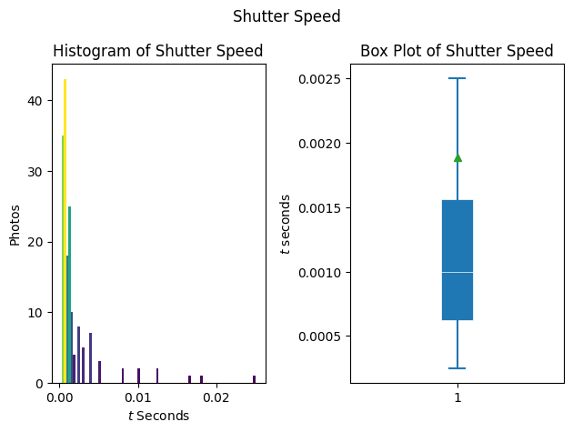
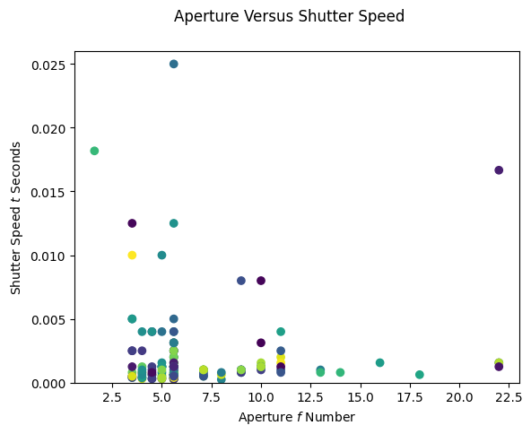
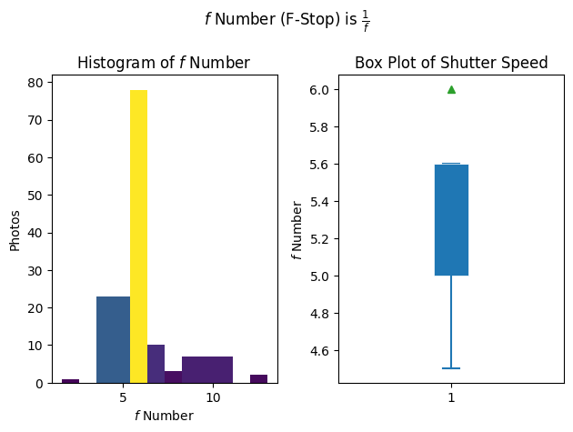
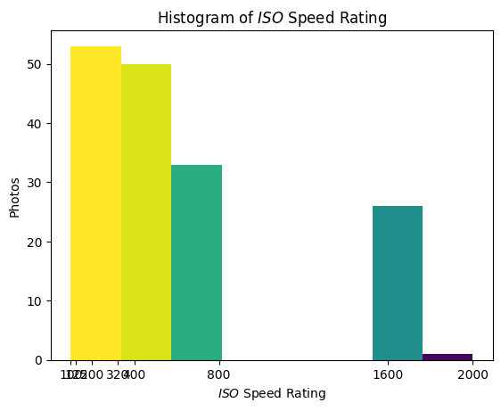
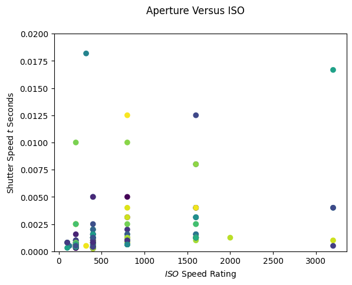
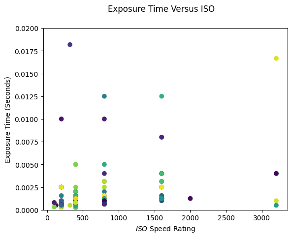

# How You Take Photos

This is a python script that visualizes the settings that you have on your camera across a set of photos you take


/Users/sammyrobens-paradise/Desktop/lights


## Include All the Dependencies

First you will need:

- [Python 3](https://www.python.org/downloads/)
- [Homebrew](https://brew.sh)
- [pip](https://pip.pypa.io/en/stable/installation/) (You can also use Conda but)
- [Juypter Notebook](https://jupyter.org/install)

lets include all the depdencies. Before you begin, make sure you have installed the depencies.
You can do this by running `Make install` which will install the dependencies in `requirements.text`. You can also manually install the dependencies listed below.


## Install Dependencies


```python
# install dependencies
import numpy as np
import matplotlib.pyplot as plt
import matplotlib.colors as mcolors
from PIL import Image, ExifTags
from PIL.ExifTags import TAGS
import glob
import os
```

Input the file path to the folder containing the images you want to visualize


```python
# path_to_image_dir = input("Enter the complete path to the image folder")
path_to_image_dir = "/Users/sammyrobens-paradise/Desktop/lights"
print("Loading images from " + path_to_image_dir + "...")

directory = os.fsencode(path_to_image_dir)
image_paths = glob.glob(path_to_image_dir + "/*")
num_images = len(image_paths)
print(str(num_images) + " images found in " + path_to_image_dir)
```

    Loading images from /Users/sammyrobens-paradise/Desktop/lights...
    168 images found in /Users/sammyrobens-paradise/Desktop/lights


```python
# Define all our classes, types and helper functions
class Exif:
    ResolutionUnit: int
    ExifOffset: int
    Make: str
    Model: str
    Software: str
    DateTime: str
    XResolution: float
    YResolution: float
    ExitVersion: bytes
    ShutterSpeedValue: float
    ApertureValue: float
    DateTimeOriginal: str
    DateTimeDigitized: str
    ExposureBiasValue: float
    MaxApertureValue: float
    MeteringMode: int
    ColorSpace: int
    Flash: int
    FocalLength: float
    ExposureMode: int
    WhiteBalance: int
    SceneCaptureType: int
    FocalPlaneXResolution: float
    FocalPlaneYResolution: float
    OffsetTime: str
    SubsecTimeOriginal: str
    SubsecTimeDigitized: str
    FocalPlaneResolutionUnit: int
    ExposureTime: float
    FNumber: float
    ExposureProgram: int
    CustomRendered: int
    ISOSpeedRatings: int
    SensitivityType: int
    RecommendedExposureIndex: int
    LensSpecification: list[float, float, float, float]
    LensModel: str
    LensSerialNumber: str


def reject_outliers(data, m=2):
    return data[abs(data - np.mean(data)) < m * np.std(data)]


def shutter_speed_to_seconds(shutterSpeed):
    return np.array(2 ** (-1 * shutterSpeed))


def aperture_to_stops(aperture):
    return np.array(np.round((np.power(2, aperture) ** 0.5), 1))


class ImageMetadata:
    def __init__(self, filepath: str):
        source = Image.open(filepath)
        self.source = source
        self.exif: Exif = {
            ExifTags.TAGS[k]: v
            for k, v in source._getexif().items()
            if k in ExifTags.TAGS
        }

    def _get_focal_plane_x_resolution(self):
        return self.exif["FocalPlaneXResolution"]

    def _get_focal_plane_y_resolution(self):
        return self.exif["FocalPlaneYResolution"]

    def _get_shutter_speed_value(self):
        return self.exif["ShutterSpeedValue"]

    def _get_aperture_speed_value(self):
        return self.exif["ApertureValue"]

    def _get_f_number(self):
        return self.exif["FNumber"]

    def _get_ISO_speed_rating(self):
        return self.exif["ISOSpeedRatings"]

    def _get_exposure_time(self):
        return self.exif["ExposureTime"]
```

## Generate a `data` list
The list contains all of our images and their standard `exif` tagged metadata stored as an `ImageMetadata` object


```python
data:list[ImageMetadata] = []
for path in image_paths:
    curImage = ImageMetadata(path)
    data.append(curImage)
```

## Now lets get into plotting some data...

### Shutter Speed 

lets plot the shutter speed of your photos


```python
shutterSpeed = []
for item in data:
    shutterSpeed.append(item._get_shutter_speed_value())
    # print(shutterSpeed[len(shutterSpeed) - 1])

shutterSpeed = np.array(shutterSpeed, dtype=float)
Tv = shutter_speed_to_seconds(shutterSpeed)
Tv = reject_outliers(Tv)
bins = int(np.rint(len(Tv) / 2))
fig, axs = plt.subplots(1, 2, tight_layout=True)
fig.suptitle("Shutter Speed")
N, bins, patches = axs[0].hist(Tv, bins=bins)
fracs = N / N.max()
norm = mcolors.Normalize(fracs.min(), fracs.max())
for thisfrac, thispatch in zip(fracs, patches):
    color = plt.cm.viridis(norm(thisfrac))
    thispatch.set_facecolor(color)
axs[0].set_title("Histogram of Shutter Speed")
axs[0].set_ylabel("Photos")
axs[0].set_xlabel("$t$ Seconds")
axs[1].boxplot(
    Tv,
    patch_artist=True,
    showmeans=True,
    showfliers=False,
    medianprops={"color": "white", "linewidth": 0.5},
    boxprops={"facecolor": "C0", "edgecolor": "white", "linewidth": 0.5},
    whiskerprops={"color": "C0", "linewidth": 1.5},
    capprops={"color": "C0", "linewidth": 1.5},
)
axs[1].set_title("Box Plot of Shutter Speed")
axs[1].set_ylabel("$t$ seconds")
axs[1].set_xlabel(" ")
plt.show()
```


    

    


### What about shutter speed relative to Aperture?


```python
points = np.array(
    [
        [item._get_shutter_speed_value(), item._get_aperture_speed_value()]
        for item in data
    ],
    dtype=float,
)

points[:, 0] = shutter_speed_to_seconds(points[:, 0])
points[:, 1] = aperture_to_stops(points[:, 1])
Tv = points[:, 0]
Av = points[:, 1]

assert len(Tv) == len(Av)
plt.figure()
plt.suptitle("Aperture Versus Shutter Speed")
plt.scatter(Av, Tv, c=np.random.rand(len(points)))
plt.ylim(0, 0.026)
plt.xlabel("Aperture $f$ Number")
plt.ylabel("Shutter Speed $t$ Seconds")

plt.show()
```


    

    


### Whats the $f$ Number for your photos?


```python
Fn = np.array([item._get_f_number() for item in data], dtype=float)
Fn = reject_outliers(Fn)
bins = len(np.unique(Fn))
fig, axs = plt.subplots(1, 2, tight_layout=True)
fig.suptitle("$f$ Number (F-Stop) is $\\frac{1}{f}$")
N, bins, patches = axs[0].hist(Fn, bins=bins)
fracs = N / N.max()
norm = mcolors.Normalize(fracs.min(), fracs.max())
for thisfrac, thispatch in zip(fracs, patches):
    color = plt.cm.viridis(norm(thisfrac))
    thispatch.set_facecolor(color)
axs[0].set_title("Histogram of $f$ Number")
axs[0].set_ylabel("Photos")
axs[0].set_xlabel("$f$ Number")
axs[1].boxplot(
    Fn,
    patch_artist=True,
    showmeans=True,
    showfliers=False,
    medianprops={"color": "white", "linewidth": 0.5},
    boxprops={"facecolor": "C0", "edgecolor": "white", "linewidth": 0.5},
    whiskerprops={"color": "C0", "linewidth": 1.5},
    capprops={"color": "C0", "linewidth": 1.5},
)
axs[1].set_title("Box Plot of Shutter Speed")
axs[1].set_ylabel("$f$ Number")
axs[1].set_xlabel(" ")
plt.show()
```


    

    


### What about ISO?


```python
ISO = np.array([item._get_ISO_speed_rating() for item in data], dtype=float)
ISO = reject_outliers(ISO)
bins = len(np.unique(ISO))
plt.figure()
N, bins, patches = plt.hist(ISO, bins=bins)
fracs = N / N.max()
norm = mcolors.Normalize(fracs.min(), fracs.max())
for thisfrac, thispatch in zip(fracs, patches):
    color = plt.cm.viridis(norm(thisfrac))
    thispatch.set_facecolor(color)
plt.title("Histogram of $ISO$ Speed Rating")
plt.ylabel("Photos")
plt.xlabel("$ISO$ Speed Rating")
plt.xticks(np.unique(ISO))
plt.show()
```


    

    


### What about ISO versus shutter speed?


```python
points = np.array(
    [[item._get_shutter_speed_value(), item._get_ISO_speed_rating()] for item in data],
    dtype=float,
)
points[:, 0] = shutter_speed_to_seconds(points[:, 0])
Tv = points[:, 0]
ISO = points[:, 1]
assert len(Tv) == len(ISO)
plt.figure()
plt.suptitle("Aperture Versus ISO")
plt.scatter(ISO, Tv, c=np.random.rand(len(points)))
plt.ylim(0, 0.02)
plt.xlabel("$ISO$ Speed Rating")
plt.ylabel("Shutter Speed $t$ Seconds")
plt.show()
```


    

    


```python
points = np.array(
    [[item._get_ISO_speed_rating(), item._get_exposure_time()] for item in data],
    dtype=float,
)
ISO = points[:, 0]
Et = points[:, 1]
assert len(Et) == len(ISO)
plt.figure()
plt.suptitle("Exposure Time Versus ISO")
plt.scatter(ISO, Et, c=np.random.rand(len(points)))
plt.ylim(0, 0.02)
plt.xlabel("$ISO$ Speed Rating")
plt.ylabel("Exposure Time (Seconds)")
plt.show()
```


    

    

